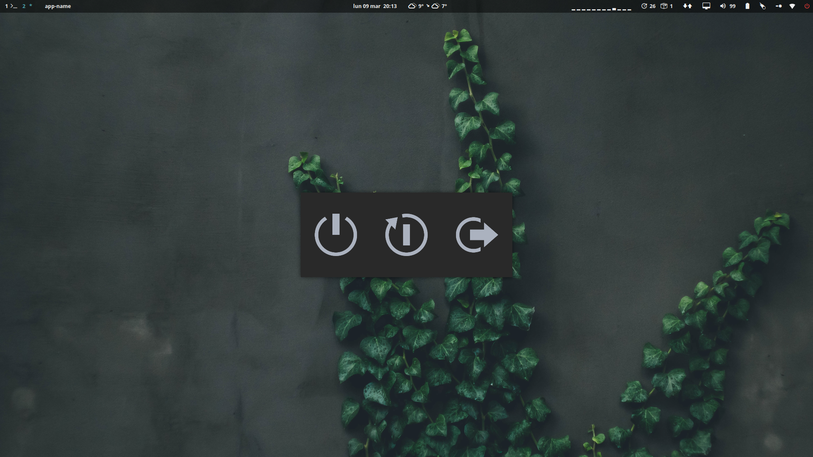

# Powermenu

A simple PowerMenu to shutdown, reboot and logout (from i3)

# Features (things might change)
- Shutdown your pc (if you have the 'shutdown' command)
- Reboot your pc (if you have the 'reboot' command)
- Log out from i3
- Doesn't work in any other case
